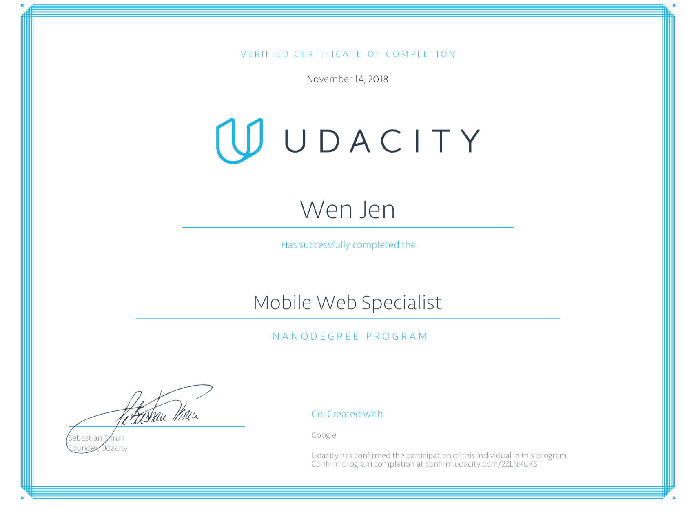

# Mobile Web Specialist Udacity Nanodegree Project

## Project Overview:

Thre Restaurant Reviews Project is a three stage Udacity review project. Given a static webpage the following features were implemented:  

* A fully responsive layout
* Restaurant Listings Page
* Restaurant Info Page
* Accessiblity updates
* Service Workers
* Offline capabilities
* Gulp
* IDB for IndexedDB
* Performance/Progressive Web App/Accessiblity meets Lighthouse 90/70/90 Standards

### Quick Start Guide
1. In this folder, start up a simple HTTP server to serve up the site files on your local computer. Python has some simple tools to do this, and you don't even need to know Python. For most people, it's already installed on your computer.
2. In a terminal, check the version of Python you have: python -V. If you have Python 2.x, spin up the server with python -m SimpleHTTPServer 8000 (or some other port, if port 8000 is already in use.) For Python 3.x, you can use python3 -m http.server 8000. If you don't have Python installed, navigate to Python's website to download and install the software.
3. Run `npm install`.
4. Run `gulp`.
5. With your server running, visit the site: http://localhost:8000.
6. Change directories to the mws server folder.
7. Run `npm install`
8. Development local API Server
_Location of server = /server_
Server depends on [node.js LTS Version: v6.11.2 ](https://nodejs.org/en/download/), [npm](https://www.npmjs.com/get-npm), and [sails.js](http://sailsjs.com/)
Please make sure you have these installed before proceeding forward.
91. `npm i`
10. `npm i sails -g`
11. `node server`

##### You should now have access to your API server environment
	debug: Environment : development
	debug: Port        : 1337

